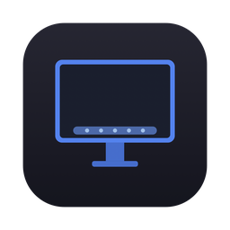

<p align="center">
  
</p>

<h1 align="center">SmartDock</h1>

<p align="center">
  <strong>Automatic Dock manager for macOS — different Dock settings for different displays</strong>
</p>

<p align="center">
  
  
  
  
</p>

---

SmartDock lives in your menu bar and automatically switches Dock configuration when you connect or disconnect an external monitor. Configure separate settings for each mode — position, icon size, magnification, autohide — and SmartDock applies them instantly.

## ✨ Features

| | Feature | Details |
|---|---|---|
| 🖥️ | **Two-mode Dock profiles** | Separate settings for external monitor vs. built-in display |
| 📍 | **Position control** | Bottom, Left, or Right — per mode |
| 📐 | **Icon size & magnification** | Independent size sliders for each mode |
| 👁️ | **Autohide toggle** | Show/hide Dock per mode |
| ⚡ | **Instant detection** | Event-driven via `CGDisplayRegisterReconfigurationCallback` — no polling |
| 🎨 | **Glass UI** | Translucent settings window with `NSVisualEffectView` |
| 🔄 | **Sync from System** | One-click import of current Dock settings |
| 🚀 | **Launch at Login** | Native `SMAppService` integration |
| 🛡️ | **Smooth transitions** | Per-property AppleScript — no Dock restart needed |

## 📸 How It Works

```
┌─────────────────────────────────────────────────────────┐
│                                                         │
│   🖥️ External Monitor Connected                         │
│   ┌─────────────────────┐                               │
│   │  Dock: Bottom        │  ← Your "external" profile   │
│   │  Size: 64px          │                               │
│   │  Autohide: Off       │                               │
│   │  Magnification: On   │                               │
│   └─────────────────────┘                               │
│                                                         │
│   💻 Built-in Display Only                               │
│   ┌─────────────────────┐                               │
│   │  Dock: Left          │  ← Your "built-in" profile   │
│   │  Size: 36px          │                               │
│   │  Autohide: On        │                               │
│   │  Magnification: Off  │                               │
│   └─────────────────────┘                               │
│                                                         │
└─────────────────────────────────────────────────────────┘
```

## 📦 Installation

### From Homebrew

```bash
brew install --cask alexeikaratai/tap/smartdock
```

After install, grant Accessibility permission in **System Settings → Privacy & Security → Accessibility**.

### From GitHub Release

Download `SmartDock.app` from [Releases](https://github.com/alexeikaratai/smartdock/releases). To open unsigned app:

```bash
xattr -cr /Applications/SmartDock.app
codesign --force --deep --sign - /Applications/SmartDock.app
open /Applications/SmartDock.app
```

Or: right-click → Open → Open in the dialog.

### From Source

```bash
git clone https://github.com/alexeikaratai/smartdock.git
cd smartdock
make run
```

## 🧪 Run Tests

```bash
make test
```

## 🏗️ Architecture

```
Sources/
├── SmartDockCore/                    # Testable business logic
│   ├── DockConfiguration.swift       # DockConfiguration model + UserPreferences
│   ├── DisplayMonitor.swift          # CG callback + debounce for display changes
│   ├── DockController.swift          # Per-property AppleScript via System Events
│   ├── SmartDockService.swift        # Orchestrator: display state → dock config
│   └── Log.swift                     # Logger API (macOS 14+)
└── SmartDock/                        # AppKit UI layer
    ├── App.swift                     # @main entry, manual NSApplication run loop
    ├── StatusBarController.swift     # Menu bar icon & dropdown
    ├── SettingsWindow.swift          # Glass settings window (Auto Layout)
    ├── LaunchAtLogin.swift           # SMAppService wrapper
    └── AccessibilityChecker.swift    # Permission check & prompt
```

### Key Design Decisions

| Decision | Why |
|---|---|
| **AppleScript via System Events** | Graceful Dock updates without `killall Dock` — no visual glitch, no restart |
| **Per-property `tell` blocks** | Each setting applied independently — one failure doesn't block others |
| **Debounced display callbacks** | 1s settle delay filters transient CG callbacks during Mission Control / fullscreen transitions |
| **Swift 6 strict concurrency** | `@MainActor` on all UI and service types — no data races |
| **Protocol-based DI** | `DisplayMonitoring` / `DockControlling` protocols enable mock-based testing |
| **Event-driven detection** | `CGDisplayRegisterReconfigurationCallback` — no timers, no polling |
| **Diff-based apply** | Only runs AppleScript for properties that actually changed — no dock flash |
| **Wake recovery** | Re-applies config after sleep/wake to fix macOS resetting dock state |

## 🔐 Permissions

On first launch, SmartDock checks for **Accessibility** permission and shows a dialog linking to **System Settings → Privacy & Security → Accessibility**. This is required for AppleScript control of Dock preferences via System Events.

## 🛠️ Requirements

- macOS 14.0+ (Sonoma)
- Swift 6.0+
- Xcode 16+ / Command Line Tools (`xcode-select --install`)

## 👤 Author

**Alex Karatai**

## 📄 License

MIT License. See [LICENSE](LICENSE) for details.
