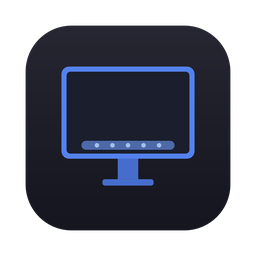
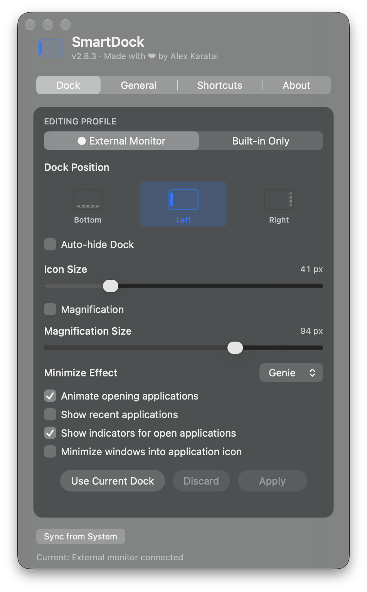

<p align="center">
  
</p>

<h1 align="center">SmartDock</h1>

<p align="center">
  <strong>Automatic Dock manager for macOS — different Dock settings for different displays</strong>
</p>

<p align="center">
  
  
  
  
</p>

---

SmartDock lives in your menu bar and automatically switches Dock configuration when you connect or disconnect an external monitor. Configure separate settings for each mode — position, icon size, magnification, autohide — and SmartDock applies them instantly.

## ✨ Features

| | Feature | Details |
|---|---|---|
| 🖥️ | **Two-mode Dock profiles** | Separate settings for external monitor vs. built-in display |
| 📍 | **Position control** | Bottom, Left, or Right — per mode |
| 📐 | **Icon size & magnification** | Independent size sliders for each mode |
| 👁️ | **Autohide toggle** | Show/hide Dock per mode |
| ⚡ | **Instant detection** | Event-driven via `CGDisplayRegisterReconfigurationCallback` — no polling |
| 🔄 | **System sync** | Auto-imports Dock changes from System Settings via KVO |
| 🔔 | **Notifications** | macOS banner when profile switches (optional) |
| ⌨️ | **Global hotkeys** | 5 customizable shortcuts — toggle autohide, refresh, switch profiles, open settings |
| 🔗 | **URL scheme** | `smartdock://` commands for Raycast, Alfred, Shortcuts.app and shell scripts |
| 📜 | **AppleScript** | Scriptable from Script Editor, `osascript`, Automator and Shortcuts |
| 🎨 | **Glass UI** | Tabbed settings window (Settings / Shortcuts / About) with `NSVisualEffectView` |
| 🚀 | **Launch at Login** | Native `SMAppService` integration |
| 🛡️ | **Smooth transitions** | Per-property AppleScript — no Dock restart needed |
| 👋 | **Onboarding** | Welcome screen on first launch |

## 📸 Screenshot

<p align="center">
  
</p>

## 📦 Installation

### From Homebrew

```bash
brew install --cask alexeikaratai/tap/smartdock
```

After install, grant Accessibility permission in **System Settings → Privacy & Security → Accessibility**.

### From GitHub Release

Download `SmartDock.app` from [Releases](https://github.com/alexeikaratai/smartdock/releases). To open unsigned app:

```bash
xattr -cr /Applications/SmartDock.app
codesign --force --deep --sign - /Applications/SmartDock.app
open /Applications/SmartDock.app
```

Or: right-click → Open → Open in the dialog.

### From Source

```bash
git clone https://github.com/alexeikaratai/smartdock.git
cd smartdock
make run
```

## 🔗 Automation

SmartDock registers a `smartdock://` URL scheme, so any tool that can open a URL
can drive it — Raycast, Alfred, Shortcuts.app, or a plain shell script:

```bash
open smartdock://refresh            # re-apply the config for the current display setup
open smartdock://switch/external    # force the External Monitor profile
open smartdock://switch/builtin     # force the Built-in Only profile
open smartdock://toggle-autohide    # flip auto-hide on the active profile
open smartdock://settings           # open the Settings window
```

### AppleScript

SmartDock ships a scripting dictionary — open it in Script Editor with
**File → Open Dictionary…**, or drive the app directly:

```applescript
tell application "SmartDock"
    refresh              -- re-apply the config for the current display setup
    switch to external   -- force the External Monitor profile
    switch to builtin    -- force the Built-in Only profile
    toggle autohide      -- flip auto-hide on the active profile
    show settings        -- open the Settings window
end tell
```

From the shell:

```bash
osascript -e 'tell application "SmartDock" to switch to external'
```

Hotkeys, URLs and AppleScript all run through one code path, so the three can never
disagree about what a command does.

## 🧪 Run Tests

```bash
make test       # run the suite (sequentially — see CONTRIBUTING.md)
make coverage   # run it with a per-file coverage table
make lint       # verify formatting — CI gates on this
make format     # apply formatting
```

See [CONTRIBUTING.md](CONTRIBUTING.md) for conventions, the style rules that are
switched off on purpose, and what the coverage numbers do and don't cover.

## 🏗️ Architecture

```
Sources/
├── SmartDockCore/                    # Testable business logic
│   ├── DockConfiguration.swift       # DockConfiguration + HotkeyBinding + UserPreferences
│   ├── DisplayMonitor.swift          # CG callback + debounce for display changes
│   ├── DockController.swift          # AppleScript Dock control + KVO system sync
│   ├── SmartDockService.swift        # Orchestrator: display state → dock config
│   ├── URLCommand.swift              # smartdock:// URL parsing
│   ├── AppleScriptCommand.swift      # dock profile ↔ Apple Event code mapping
│   ├── DiagnosticReport.swift        # Bug-report snapshot formatting
│   └── Log.swift                     # Logger API (macOS 14+)
└── SmartDock/                        # AppKit UI layer
    ├── App.swift                     # @main entry, manual NSApplication run loop
    ├── ScriptingSupport.swift        # NSScriptCommand subclasses for the sdef
    ├── StatusBarController.swift     # Menu bar icon & dropdown with SF Symbol icons
    ├── SettingsWindow.swift          # Tabbed glass window (Settings / Shortcuts / About)
    ├── OnboardingWindow.swift        # First-launch welcome screen
    ├── NotificationManager.swift     # macOS banner notifications
    ├── HotkeyManager.swift           # Global keyboard shortcuts (5 actions)
    ├── HotkeyRecorder.swift          # Captures a keystroke into a binding
    ├── AppRelauncher.swift           # Safe relaunch — waits for PID exit first
    ├── AppUpdateWatcher.swift        # Detects Homebrew upgrade, prompts relaunch
    ├── LaunchAtLogin.swift           # SMAppService wrapper
    ├── AccessibilityChecker.swift    # First-launch Accessibility prompt
    └── Views/                        # Self-contained UI pieces
        ├── UI.swift                  # Shared control & glass window factories
        ├── PositionIcon.swift        # Cached dock-position thumbnails
        ├── PositionPicker.swift      # Position button row
        ├── AboutTabView.swift        # About tab contents
        └── AccessibilityWarningView.swift  # Permission banner & reset flow
```

### Key Design Decisions

| Decision | Why |
|---|---|
| **AppleScript via System Events** | Graceful Dock updates without `killall Dock` — no visual glitch, no restart |
| **Per-property `tell` blocks** | Each setting applied independently — one failure doesn't block others |
| **Debounced display callbacks** | 1s settle delay filters transient CG callbacks during Mission Control / fullscreen transitions |
| **Swift 6 strict concurrency** | `@MainActor` on all UI and service types — no data races |
| **Protocol-based DI** | `DisplayMonitoring` / `DockControlling` protocols enable mock-based testing |
| **Event-driven detection** | `CGDisplayRegisterReconfigurationCallback` — no timers, no polling |
| **Diff-based apply** | Only runs AppleScript for properties that actually changed — no dock flash |
| **KVO system sync** | Observes `com.apple.dock` UserDefaults — auto-imports changes from System Settings |
| **One command path** | Hotkeys, `smartdock://` URLs and AppleScript all reach `HotkeyManager.perform` — three front doors, one implementation |
| **Hotkey caching** | Bindings cached in memory — no UserDefaults reads on every keystroke |
| **Wake recovery** | Re-applies config after sleep/wake to fix macOS resetting dock state |

## 🔐 Permissions

SmartDock asks for two separate permissions:

| Permission | Needed for | When |
|---|---|---|
| **Automation** (System Events) | Core dock switching via AppleScript | macOS prompts once, the first time SmartDock changes the Dock |
| **Accessibility** | Global keyboard shortcuts only | Prompted on first launch — **optional**, everything else works without it |

Both live in **System Settings → Privacy & Security**. If hotkeys stop working after a Homebrew update, ad-hoc signing has invalidated the Accessibility grant — use **Settings → Shortcuts → Reset Permission**.

## 🛠️ Requirements

- macOS 14.0+ (Sonoma) to **run**
- Swift 6.2+ to **build** — the package declares `swift-tools-version: 6.2`
- Xcode 26+ / matching Command Line Tools (`xcode-select --install`). Swift 6.2 first shipped in Xcode 26, so earlier Xcode versions cannot build this package.

## 👤 Author

**Alex Karatai**

## 📄 License

MIT License. See [LICENSE](LICENSE) for details.
